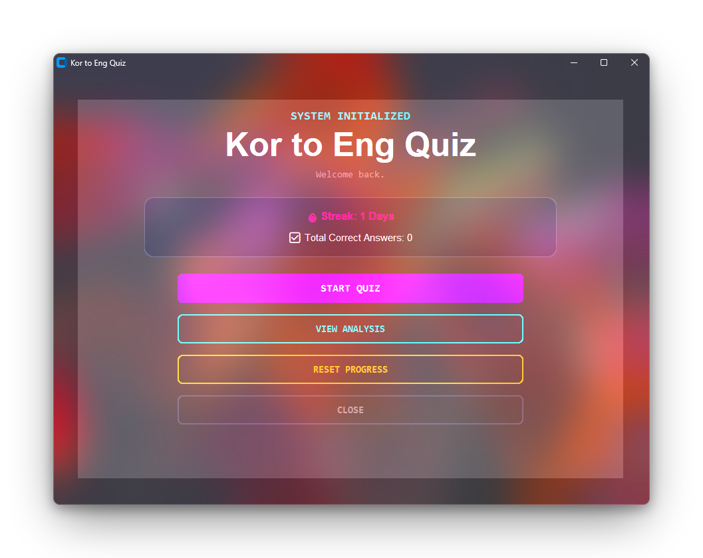

# Kor to Eng Quiz

A desktop flashcard-style quiz for learning beginner Korean vocabulary. You're shown a Korean word and type its English meaning. The app tracks your daily streak, remembers which words you struggle with, and shows those words more often so you spend your time where it counts.

Built with Python and [CustomTkinter](https://github.com/TomSchimansky/CustomTkinter), with a dark neon theme.

<p align="center">
  
</p>

---

## Features

- **Korean → English quiz.** 10 questions per session, with a progress bar and instant feedback after each answer.
- **Adaptive word selection.** Words you get wrong come up more often. Weaker words are weighted more heavily, and no word repeats within a single quiz.
- **Flexible answer checking.**
  - Not case-sensitive, and leading/trailing spaces are ignored.
  - Entries like `hi/bye` accept `hi`, `bye`, or `hi/bye`.
  - Entries like `goodbye (to someone leaving)` also accept just `goodbye`.
- **Skip button.** Reveals the answer and counts the word as missed.
- **Daily streak.** Goes up once per day when you start a quiz and resets if you miss a day.
- **Total correct counter** shown on the dashboard.
- **Weakness analysis screen.** Lists the words you currently struggle with, along with their English meanings.
- **Auto-save.** Progress is saved after every answer and loaded on startup.
- **Reset progress** button to wipe your streak, score, and word history.
- **Keyboard friendly.** Press `Enter` to submit an answer.

---

## Requirements

- Python 3.8 or newer
- [`customtkinter`](https://pypi.org/project/customtkinter/)
- *(Optional, Windows only)* [`pywinstyles`](https://pypi.org/project/pywinstyles/) for the acrylic window effect. The app runs fine without it.

> **Linux users:** you may also need Tkinter, e.g. `sudo apt install python3-tk`.

---

## Installation

```bash
pip install customtkinter

# Optional, Windows only
pip install pywinstyles
```

Make sure the vocabulary file `500_beginner_korean_words.csv` is in the same folder as `main.py` (see [Vocabulary file format](#vocabulary-file-format)).

---

## Running the app

Run the app **from the project folder**, because file paths are relative:

```bash
python main.py
```

---

## How to use

1. **Dashboard.** See your streak and total correct answers. From here you can:
   - **START QUIZ** to begin a 10-question session.
   - **VIEW ANALYSIS** to see your weak words.
   - **RESET PROGRESS** to clear all saved progress.
   - **CLOSE** to exit.
2. **Quiz.** Type the English meaning of the Korean word and press `Enter` or click **SUBMIT**. Click **SKIP** if you don't know it. The correct answer is shown for one second, then the next question appears.
3. **Results.** After question 10 you'll see your final score. Click **RETURN TO DASHBOARD** to go back.

---

## How scoring and mastery work

Every word has a hidden **mastery score** that starts at `0`.

| Action | Mastery change |
| --- | --- |
| Correct answer | `+1` (and total correct goes up) |
| Wrong answer | `-1` |
| Skip | `-1` |

- A word with a mastery score **below 0** counts as a **weak word** and appears on the analysis screen. Answer it correctly enough times and it drops off the list.
- When picking quiz words, each word gets a weight of `max(1, 10 - mastery)`. A lower score means a higher chance of being picked, and well-learned words still appear occasionally.

### Streak rules

- Starting a quiz on a new day adds `1` to your streak.
- Studying more than once on the same day doesn't add more.
- If your last study date is before yesterday, the streak resets to `0` the next time the app loads.

---

## Project structure

```
.
├── main.py                          # GUI (CustomTkinter) and quiz flow
├── Backend.py                       # Data loading/saving, quiz logic, streaks
├── screenshot.png                   # Dashboard screenshot used in this README
├── 500_beginner_korean_words.csv    # Vocabulary list (you provide this)
├── user_profile.txt                 # Auto-created: streak, last study date, total correct
└── mastery_data.txt                 # Auto-created: per-word mastery scores
```

`user_profile.txt` and `mastery_data.txt` are created automatically the first time you study. Deleting them (or using **RESET PROGRESS**) gives you a fresh start.

---

## Vocabulary file format

`500_beginner_korean_words.csv` must be a UTF-8 CSV with a header row. The app reads **column 2 as the Korean word** and **column 3 as the English meaning**. Column 1 is ignored (for example, a row number). Rows missing either value are skipped.

```csv
id,korean,english
1,안녕하세요,hello
2,감사합니다,thank you
3,안녕,hi/bye
4,잘 가,goodbye (to someone leaving)
```

You can swap in your own word list as long as it follows this layout. To use a different filename, change `VOCAB_FILE` at the top of `Backend.py`.

---

## Saved data format

Both save files are plain text and easy to inspect.

**`user_profile.txt`** (three lines):

```
5
2026-10-01
132
```

These are the streak, the last study date (ISO format), and the total correct answers.

**`mastery_data.txt`** (one word per line, only non-zero scores are stored):

```
안녕,2
감사,-1
```

---

## Backend notes

`Backend.py` already includes some functionality the current interface doesn't expose, which could be built into the UI later:

- `get_quiz_batch("weak_words")` builds a quiz made only of words with a negative mastery score.
- `check_answer_logic(..., mode="en_to_kr")` supports checking English → Korean answers.

---

## Troubleshooting

| Problem | Fix |
| --- | --- |
| *"Vocabulary could not be loaded. Check the CSV file."* | Make sure `500_beginner_korean_words.csv` is in the same folder as `main.py` and that you launch the app from that folder. |
| *"pywinstyles is not installed. Acrylic effect disabled."* | Harmless message. Install `pywinstyles` on Windows if you want the effect, or ignore it. |
| *"Warning: Invalid user profile found. Starting fresh."* | Your `user_profile.txt` is corrupted or edited incorrectly. Delete it or use **RESET PROGRESS**. |
| `ModuleNotFoundError: customtkinter` | Run `pip install customtkinter`. |
